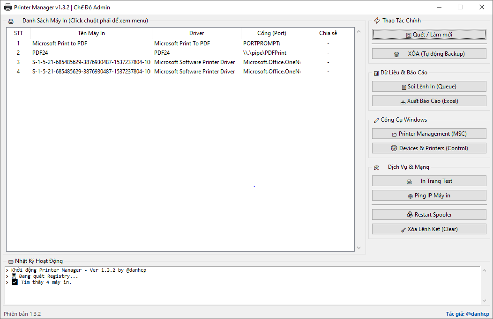

# 🖨️ Printer Manager (Portable)

**Công cụ Quản lý & Sửa lỗi Máy in Toàn diện trên Windows**  
*Phiên bản: 1.3.2 (Final)*  
*Tác giả: @danhcp*

-orange.svg?style=flat-square)

## 📖 Giới thiệu

**Printer Manager** là phần mềm dạng **Portable** (chạy ngay không cần cài đặt), ban đầu được thiết kế để sửa lỗi máy in "cứng đầu". Ở phiên bản mới nhất, công cụ đã được nâng cấp thành một trình quản lý máy in mạnh mẽ, thay thế hoàn hảo cho giao diện Control Panel cũ kỹ.

Công cụ này giải quyết các vấn đề:
*   Máy in bị kẹt, không thể xóa (Remove device không tác dụng).
*   Cần xem chi tiết ai đang in, file gì, dung lượng bao nhiêu (Soi lệnh in).
*   Quản lý bật/tắt chia sẻ (Share LAN) nhanh chóng.
*   Kiểm tra kết nối mạng (Ping IP) của máy in.

## ✨ Tính năng nổi bật (v1.3.2)

### 🛠️ Sửa lỗi & Dọn dẹp
1.  **Xóa Máy In Tận Gốc:** Can thiệp Registry để xóa bỏ máy in và Driver (kèm tính năng **Auto Backup** trước khi xóa).
2.  **Xóa Lệnh In Kẹt (Clear Queue):** Xóa sạch toàn bộ lệnh in treo chỉ với 1 click.
3.  **Tự Động Xử Lý Spooler:** Tự động Restart dịch vụ Print Spooler để tránh lỗi.

### 📊 Quản lý & Tiện ích
4.  **Menu Chuột Phải Thông Minh:**
    *   ⭐ Đặt máy in mặc định (Set Default).
    *   🔄 Bật/Tắt chia sẻ mạng LAN (Toggle Sharing).
    *   📄 Xem chi tiết hàng đợi in.
    *   🖨️ In trang Test (Windows Test Page).
5.  **Soi Lệnh In (Queue Viewer):** Xem danh sách file đang chờ in (Tên tài liệu, Người in, Số trang, Dung lượng KB/MB).
6.  **Xuất Báo Cáo:** Xuất danh sách toàn bộ máy in ra file Excel (`.csv`) để kiểm kê tài sản.
7.  **Công Cụ Mạng:** Tự động tách IP từ cổng máy in và Ping kiểm tra kết nối.

### 🪟 Tích hợp Hệ thống
8.  **Truy cập nhanh:** Mở nhanh *Print Management (MSC)* và *Devices & Printers*.
9.  **Nhật ký (Log):** Tự động lưu lịch sử thao tác vào file `nhat_ky_hoat_dong.log`.

## 💻 Yêu cầu hệ thống

*   **Hệ điều hành:** Windows 7, 10, 11 (32-bit & 64-bit).
*   **Quyền hạn:** Bắt buộc chạy bằng quyền **Administrator**.

## 📝 Hướng dẫn sử dụng

### Bước 1: Khởi động
Do phần mềm can thiệp sâu vào hệ thống, bạn **BẮT BUỘC** phải:
1.  Nhấn chuột phải vào file `PrinterManager.exe`.
2.  Chọn **Run as Administrator**.

### Bước 2: Các thao tác chính
*   **Quét danh sách:** Nhấn **🔄 Quét / Làm mới** để tải danh sách máy in từ Registry.
*   **Menu nhanh:** **Click chuột phải** vào một dòng máy in bất kỳ để hiện menu (Đặt mặc định, Share, In test...).
*   **Xóa máy in:** Chọn máy in ➔ Nhấn **🗑️ XÓA**. (File backup sẽ được lưu tại thư mục `Backup/`).

### Bước 3: Quản lý nâng cao
*   **Xem ai đang in:** Chọn máy in ➔ Nhấn **📄 Soi Lệnh In (Queue)**.
*   **Xuất Excel:** Nhấn **📥 Xuất Báo Cáo** để lưu file `.csv`.
*   **Công cụ Windows:** Sử dụng nhóm nút bên phải để mở *Print Management* hoặc *Control Panel Printers*.

---

## ⚠️ Lưu ý quan trọng

1.  **An toàn dữ liệu:** Phần mềm có tính năng tự động Backup Registry trước khi xóa. Tuy nhiên, hãy cẩn trọng khi thao tác với các máy in hệ thống (Microsoft Print to PDF, Fax...).
2.  **Phần mềm diệt virus:** Một số trình diệt virus có thể cảnh báo nhầm do hành vi can thiệp Registry. Đây là điều bình thường với các công cụ dạng System Tools.

---

## 📞 Thông tin liên hệ & Hỗ trợ

Nếu bạn gặp vấn đề khi sử dụng hoặc muốn góp ý tính năng mới, vui lòng... **tự làm** vì đây là **vibecode** (code vì đam mê) :))

*   **Tác giả:** @danhcp
*   **Phiên bản:** 1.3.2 Final

---
*Cảm ơn bạn đã sử dụng Printer Registry Manager!*